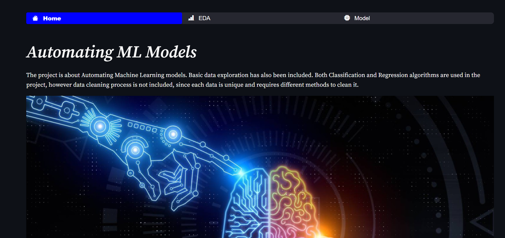
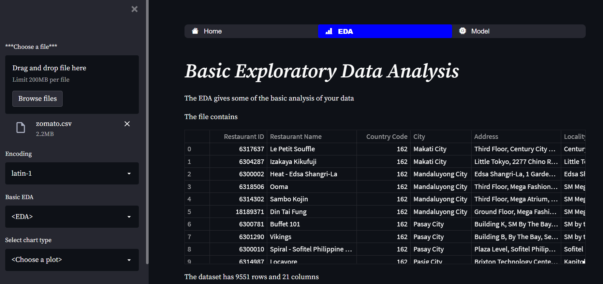
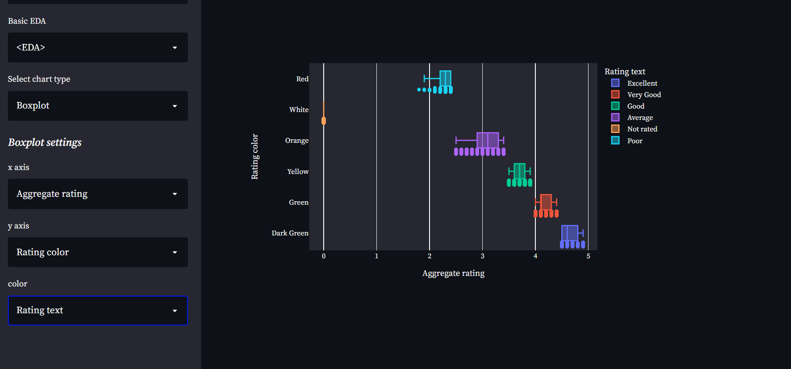
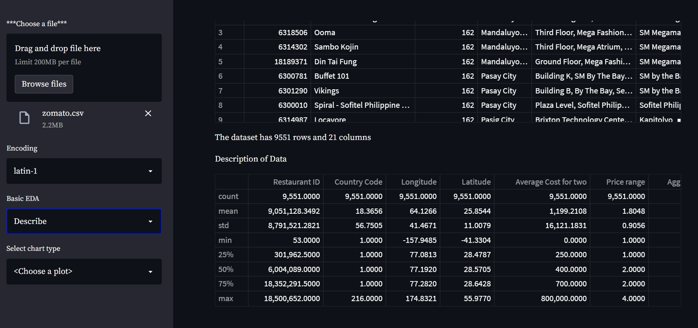
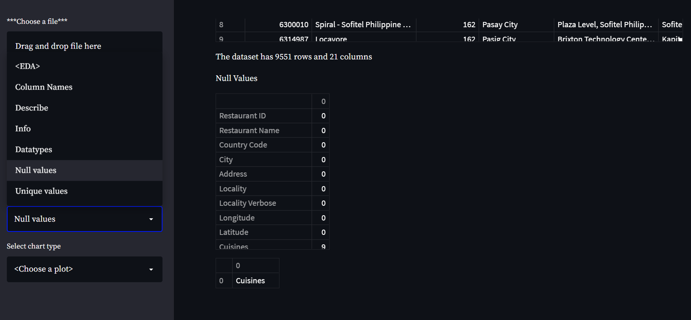
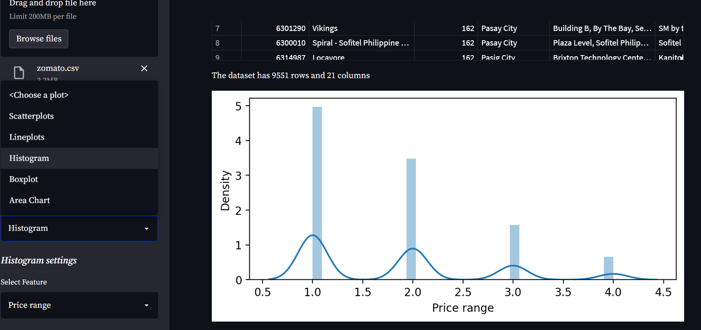
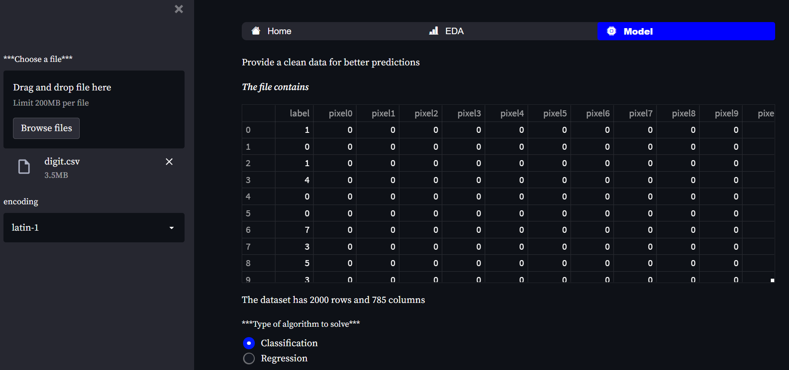
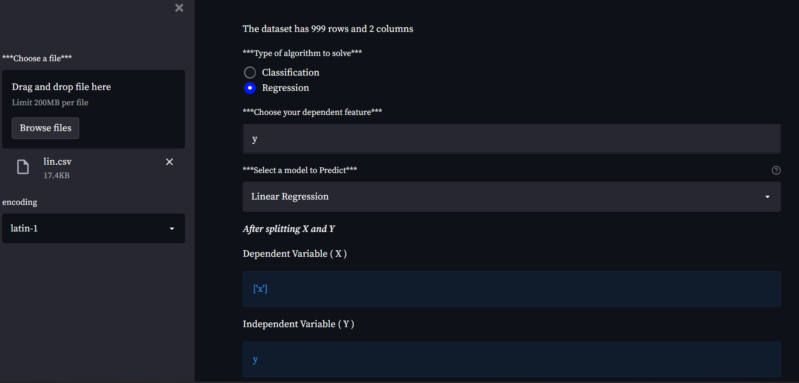
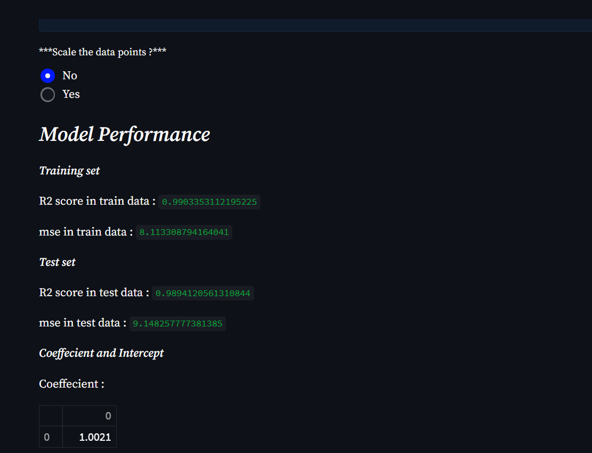
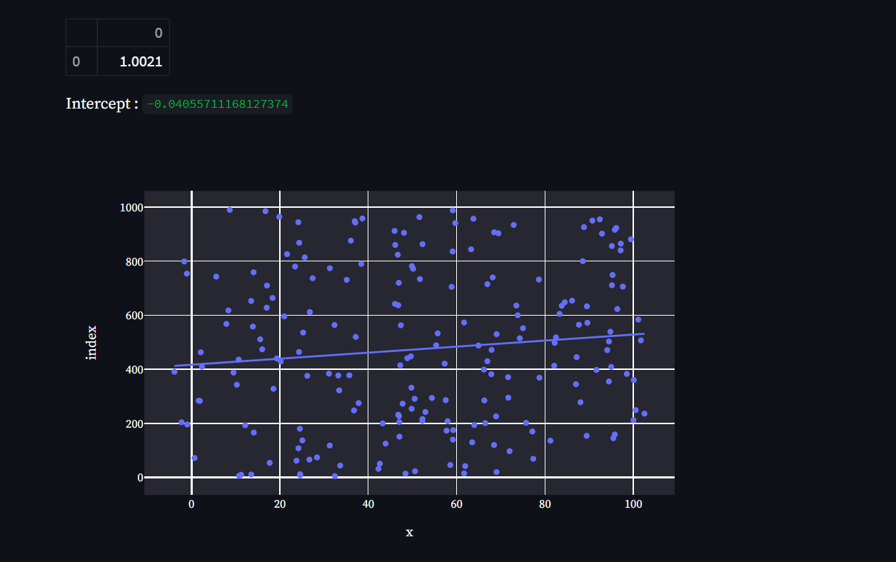

## Automating Machine Learning Models

## Overview

* Designed and developed an end-to-end model on automating machine learning algorithms with Streamlit

* The project focuses on automating some of the popular classification and regression algorithms (Logistic regression, Naive Bayes, Stochastic gradient descent, KNN, Decision tree, Random forest, SVM, Gradient boosting, XGboost, Linear regression, Lasso)

* Some of the basic EDA's and Visualizations are also performed

